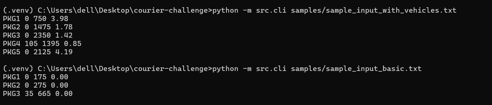

# 📦 Courier Service Estimation CLI (Python)

## 🧠 Overview
This project implements a complete Python solution for the **Courier Service estimation challenge**.  
It calculates delivery costs with discounts and estimates delivery times based on vehicle availability and constraints.

The solution demonstrates:
- ✅ **SOLID principles** – modular, single-responsibility classes and functions.  
- ✅ **Clean code** – descriptive naming, docstrings, and error handling.  
- ✅ **TDD** – comprehensive test coverage for pricing, offers, scheduling, and parsing.  

---

## 📐 Features
- 📦 Delivery cost calculation with offer codes.
- 🚚 Shipment scheduling that optimizes package grouping and calculates delivery times.
- 🧪 Unit tests using `pytest`.
- 📥 Robust input parsing with validation and error handling.
- 📊 Sample input and output included.

---

## 📌 Assumptions
- Each package’s weight ≤ maximum carriable weight. If any package exceeds capacity, the program raises an error.
- Offers are applied according to the rules defined in `src/offers.py`.
- For multi-package shipments, the **trip time is based on the maximum distance** among packages.
- Delivery time for each package is calculated as:  
  ```
  delivery_time = departure_time + (package_distance / speed)
  ```
- **Truncation rule (per PDF):** One-way trip time is truncated to 2 decimals **before doubling for the return trip** to match expected outputs.
- Input parsing is robust and follows the format described in the problem PDF.

---

## ⚙️ Setup & Run

**Requirements:** Python 3.10+

```bash
python -m venv .venv
source .venv/bin/activate    # Windows: .venv\Scripts\activate
pip install -r requirements.txt
```

Run the CLI with a sample input:

```bash
python -m src.cli samples/sample_input_with_vehicles.txt
```

The program prints lines in the format:
```
<PackageID> <discount_amount> <total_cost> <delivery_time_in_hours>
```

---

## 🧪 Running Tests

Run all tests:
```bash
pytest -q
```

**Windows tip:** If tests fail due to imports, set `PYTHONPATH`:

```bash
set PYTHONPATH=%CD%
pytest -q
```

---

## 📥 Input Format

```
<base_delivery_cost> <no_of_packages>
<package_id> <package_weight_in_kg> <distance_in_km> <offer_code>
...
<no_of_vehicles> <max_speed> <max_carriable_weight>
```

### Example:

**Input:**
```
100 5
PKG1 50 30 OFR001
PKG2 75 125 OFFR0008
PKG3 175 100 OFFR003
PKG4 110 60 OFFR002
PKG5 155 95 NA
2 70 200
```

**Output:**
```
PKG1 0 750 3.98
PKG2 0 1475 1.78
PKG3 0 2350 1.42
PKG4 105 1395 0.85
PKG5 0 2125 4.19
```

---

## 🖥️ Run with STDIN (optional)
You can also run the program with input from standard input (`-`):

**Linux / Mac:**
```bash
python -m src.cli - << 'EOF'
100 3
PKG1 5 5 OFR001
PKG2 15 5 OFR002
PKG3 10 100 OFR003
EOF
```

**Windows (PowerShell):**
```powershell
@"
100 3
PKG1 5 5 OFR001
PKG2 15 5 OFR002
PKG3 10 100 OFR003
"@ | python -m src.cli -
```

---

## 🧱 Design Notes
- **SOLID principles:**  
  - `Package`, `Vehicle` – domain entities.  
  - `pricing.py`, `offers.py`, `scheduler.py`, `cli.py` – single-responsibility modules.
- **Scheduler algorithm:**  
  - Greedy + combinatorial selection to maximize package count per trip.  
  - Among equal-count options, chooses the **heaviest shipment** that fits.  
  - Uses a **min-heap** for vehicle availability to schedule shipments efficiently.
- **Robustness:**  
  - Input parsing validates package count, handles blank lines, and normalizes offer codes.  
  - Clear error messages for invalid data and capacity violations.
- **Truncation rule:**  
  - One-way trip time is truncated to 2 decimals **before doubling** for the return time, ensuring output matches the sample.

---

## 🧪 Test Coverage
- ✅ Delivery cost and discount calculations  
- ✅ Offer validation and edge cases  
- ✅ Vehicle scheduling and tie-breaking logic  
- ✅ Input parsing errors and blank-line handling  
- ✅ Capacity boundary tests (exact weight = capacity)

---

## 📂 Project Structure
```
src/
  ├── cli.py           # CLI entry point + input parsing
  ├── models.py        # Data models (Package, Vehicle)
  ├── offers.py        # Offer definitions and discount logic
  ├── pricing.py       # Delivery cost calculation
  └── scheduler.py     # Shipment scheduling logic
tests/
  └── ...              # Unit tests
samples/
  └── ...              # Sample input files
```

---

## 📸 Output Example



## 👨‍💻 Author
**Taha Qureshi**  
[GitHub](https://github.com/QureshiTaha) | [Portfolio](https://tahaqureshi.com)
